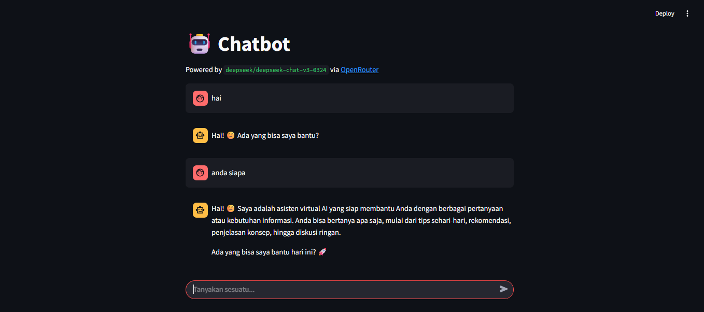

# 🤖 Chatbot OpenRouter x Streamlit

Aplikasi chatbot sederhana menggunakan model **DeepSeek Chat** dari OpenRouter dan antarmuka web berbasis **Streamlit**.




---

## 🚀 Fitur

- Chatbot interaktif berbasis web
- Menggunakan model LLM `deepseek/deepseek-chat-v3-0324` dari OpenRouter
- History percakapan disimpan selama sesi berlangsung
- UI minimalis dan responsif via Streamlit

---

## 🧠 Teknologi yang Digunakan

- [OpenRouter API](https://openrouter.ai/)
- [Streamlit](https://streamlit.io/)
- [Python `requests`](https://docs.python-requests.org/)

---

## 🛠️ Instalasi

1. **Clone repositori ini:**
2. **Buat dan aktifkan virtual environment:**

```
python -m venv venv
venv\Scripts\activate
```

3. **Install dependencies:**

```
pip install -r requirements.txt
```

4. **Running apps:**
```
streamlit run app.py
```

