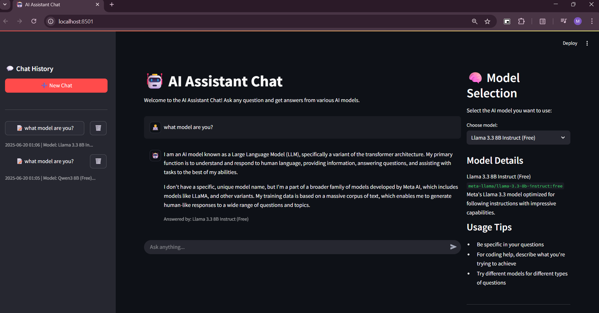

# AI Assistant Chat

<<<<<<< HEAD


=======
Aplikasi chatbot sederhana menggunakan model **DeepSeek Chat** dari OpenRouter dan antarmuka web berbasis **Streamlit**.


>>>>>>> 94bf0d4521be188bcf588cca2b5cb4d3e682b679


A flexible, user-friendly AI chatbot interface that connects to multiple language models through OpenRouter's API. This project allows users to have conversations with various AI models, organize multiple chat sessions, and choose the right model for their specific needs.

## 📖 Overview

AI Assistant Chat provides a clean, intuitive interface for interacting with powerful AI models in a chat format. Built with Streamlit, it offers features similar to popular AI interfaces like ChatGPT but with the flexibility to choose from multiple underlying models.

✨ Key Features
- Multi-model support with easy switching between different AI models
-Chat session management (create, save, and navigate between multiple conversations)
- User-friendly interface with chat history on the left, active conversation in the middle, and model selection on the right
- Informative model cards with descriptions to help select the right model for your needs
- Responsive design that works well on different screen sizes
Free and paid model options to accommodate different needs and budgets


## 🚀 Supported Models
The chatbot currently supports these models through OpenRouter:

- DeepSeek Chat v3	
- DeepSeek R1	
- Devstral Small	
- Llama 3.3 8B Instruct	Meta's
- Qwen3 8B
- Gemma 3 1B


## 🛠️ Instalasi

1. **Clone repositori ini:**
2. **Buat dan aktifkan virtual environment:**

```
python -m venv venv
venv\Scripts\activate
```

3. **Install dependencies:**

```
pip install -r requirements.txt
```
4. **Create a .env file in the project root with your OpenRouter API key:**

```
OPENROUTER_APIKEY=your_api_key_here
API_URL=https://openrouter.ai/api/v1/chat/completions
MODEL=deepseek/deepseek-chat-v3-0324
```

4. **Running apps:**
```
streamlit run app.py
```

